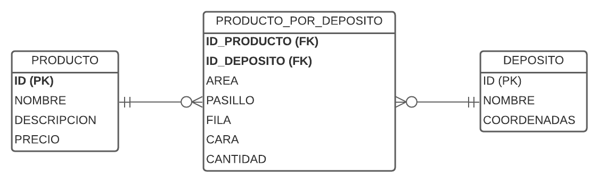

# Base de datos

## Diseño



## Scripts

**DEPOSITO**
```sql
CREATE TABLE "DEPOSITO" (
	"ID"	TEXT NOT NULL UNIQUE,
	"NOMBRE"	TEXT NOT NULL,
	"COORDENADAS"	TEXT NOT NULL,
	PRIMARY KEY("ID")
)
```

**PRODUCTO**
```sql
CREATE TABLE "PRODUCTO" (
	"ID"	INTEGER NOT NULL UNIQUE,
	"NOMBRE"	TEXT NOT NULL,
	"DESCRIPCION"	TEXT,
	"PRECIO"	NUMERIC NOT NULL,
	PRIMARY KEY("ID" AUTOINCREMENT)
)
```

**PRODUCTO_POR_DEPOSITO**
```sql
CREATE TABLE "PRODUCTO_POR_DEPOSITO" (
	"ID_PRODUCTO"	INTEGER NOT NULL,
	"ID_DEPOSITO"	TEXT NOT NULL,
	"AREA"	TEXT NOT NULL,
	"PASILLO"	INTEGER NOT NULL,
	"FILA"	INTEGER NOT NULL,
	"CARA"	TEXT NOT NULL,
	"CANTIDAD"	INTEGER NOT NULL,
	FOREIGN KEY("ID_PRODUCTO") REFERENCES "PRODUCTO"("ID"),
	FOREIGN KEY("ID_DEPOSITO") REFERENCES "DEPOSITO"("ID")
)
```
